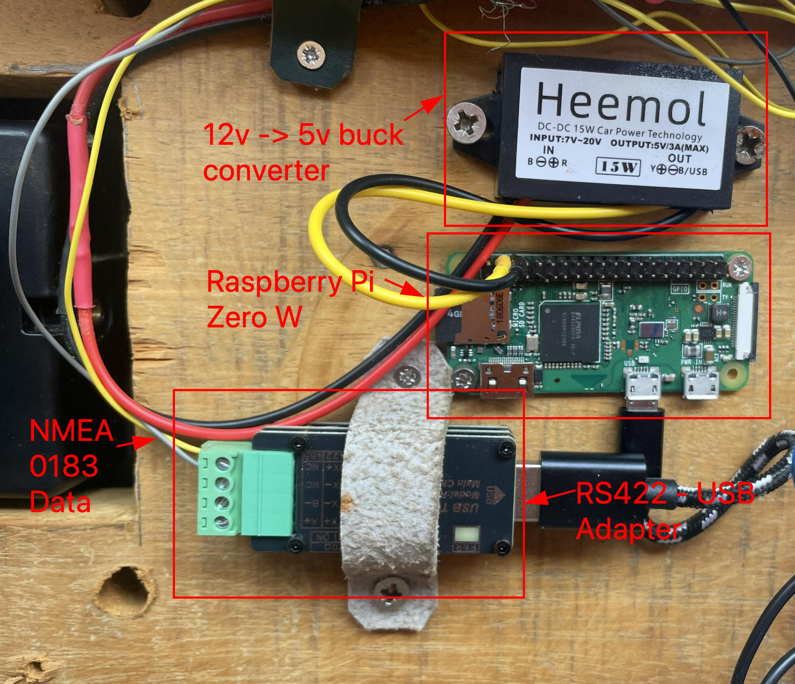

# NMEA0183 Gateway

This is a simple NMEA0183-UDP gateway using a Raspberry Pi Zero W.

# Introduction

The focus of the project is to provide a very simple, reliable interface to access instrument data remotely.

Alpine Linux in diskless mode is used to provide security against unexpected power loss. The operating system runs entirely in RAM, so the SD card is only read during boot and is never written to. This improves system performance and, more importantly, eliminates the risk of data corruption from sudden power loss. You can even remove the SD card while the system is running.

# Hardware Setup

The recommended hardware is:
- Raspberry Pi Zero W (other models are of course possible)
- 12v-5v buck converter
- RS422-USB adapter
- USB Micro to USB A female adapter

This is intended to be a read-only gateway to provide wireless access to the NMEA data from the instrument. The setup involves connecting the TX+/- wires from the instrument to the RX+/- ports of the RS422-serial adapter. The total hardware cost should be under $50.



# Repository Structure

This repository contains the configuration files needed to turn a standard Alpine Linux installation into a dedicated NMEA0183 gateway.

- **`sd_backup_files/`**: This directory contains the core configuration.
  - **`localhost.apkovl.tar.gz`**: This is an Alpine "overlay" file. It contains all the necessary scripts, services, and configuration files (like networking, access point, and the gateway service) that will be loaded into memory on boot. This is how the system is pre-configured.
  - Other files in this directory are backups of the individual configuration files that make up the overlay.

# Software Setup

1.  **Prepare the SD Card:** Use the official Raspberry Pi Imager to flash an SD card.
    -   Under "Choose OS", select "Other general-purpose OS".
    -   Select "Alpine Linux" (the latest standard RPi version, e.g., v3.19+, is recommended).
2.  **Copy Configuration:** Mount the boot partition of the newly flashed SD card. Copy all files from the `sd_backup_files` directory of this repository into the root of the boot partition.
3.  **First Boot:** Eject the SD card, insert it into the Raspberry Pi, and power it on. Wait about 15-30 seconds for the system to boot and the Wi-Fi Access Point to become visible.
4.  **Connect to the Pi:**
    -   **SSID:** `Grayhound-AIS-Gateway`
    -   **Password:** `change_me`
5.  **Access the System:** Connect to the Pi via SSH. The password is also `change_me`.
    ```sh
    ssh root@192.168.4.1
    ```

# Configuration

It is strongly recommended to change the default passwords after your first login.

1.  **Change Root Password:**
    ```sh
    passwd
    ```
2.  **Change Wi-Fi AP Details:**
    -   Edit the hostapd configuration file: `vi /etc/hostapd/hostapd.conf`
    -   Change the `ssid=` line to your desired network name.
    -   Change the `wpa_passphrase=` line to your new password.
3.  **Change Baud Rate (Optional):**
    -   The default baud rate is `38400` (common for AIS). If your instrument uses a different rate (e.g., `4800`), you need to edit the gateway service.
    -   Edit the script: `vi /etc/init.d/nmea-gw`
    -   Find the `socat` command and change the `b38400` parameter. For example, change `b38400` to `b4800`.
4.  **Commit Changes:** After making changes, you need to save them to the overlay file on the SD card so they persist after a reboot.
    ```sh
    lbu commit
    ```

# Notes

The gateway functionality is achieved using `socat`. It simply pipes the data from the serial port (`/dev/ttyUSB0`) to UDP port `10110`.

This is managed by the `/etc/init.d/nmea-gw` service script, which is controlled by OpenRC. You can manage the service with standard commands:
-   Check status: `rc-service nmea-gw status`
-   Stop service: `rc-service nmea-gw stop`
-   Start service: `rc-service nmea-gw start`

# Debugging Tips

If you encounter issues, the Raspberry Pi's serial debug port is enabled. This allows you to access the Pi's console without a monitor or network connection.

Connect a TTL RS232-USB adapter to the GPIO pins: GND (Pin 6), TX (Pin 8), and RX (Pin 10). You can then access the console with a serial monitor program:

```sh
screen /dev/ttyUSB0 115200
```
